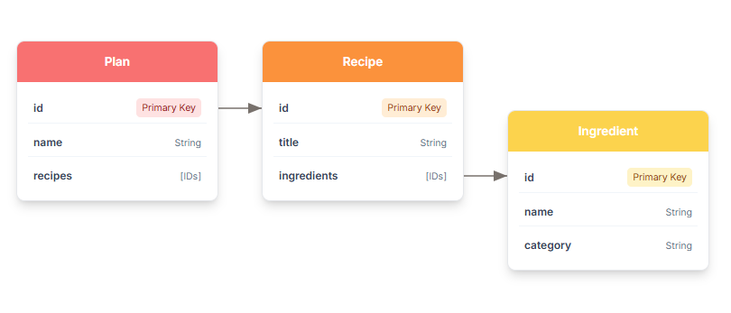

# Resource Diagrams

The MealMate API is designed around 3 primary resources:

* **[Recipes](./reference/recipes.md)**: Represents a single recipe with a title, a list of ingredients, preparation time, and cooking instructions.

* **[Ingredients](./reference/ingredients.md)**: Represents a food item that can be used in a recipe. Each ingredient has a name, category, and dietary information. Example: `isVegan`.

* **[Plans](./reference/plans.md)**: Represents a meal plan, which is a collection of recipes organized for a specific duration and dietary goal.

## Resource Relationships

A key architectural feature of the MealMate API is that it links  resources by their unique identifiers (IDs) rather than nesting them. This design keeps API responses lightweight and prevents data duplication.

**Example**: When you retrieve a `recipes` object, the API doesn't include the full details for each ingredient in the `ingredients` property. Instead, it provides an array of `id`s that correspond to the `ingredients` resources.

```json

/recipes/1 // Any given recipe is identified by unique IDs of its ingredients
{
    "id": 1,
    "title": "Quick Veggie Stir Fry",
    "ingredients": [1, 2, 3], // <--IDs of the ingredients>
    "diet": "vegetarian",
    "prepTime": 15,
    ...
}
```

## Relationship Diagram

The following is a diagram of the MealMate resource IDs relationship model:



## Other Links

[Home](./index.md)  |  [App Considerations](./mmoverview.md)  | [Architecture](mmarchitecture.md) | [Setup](./mmprefland.md) | [Tutorials](./mmtutorial.md) | [Reference](./mmref.md)
